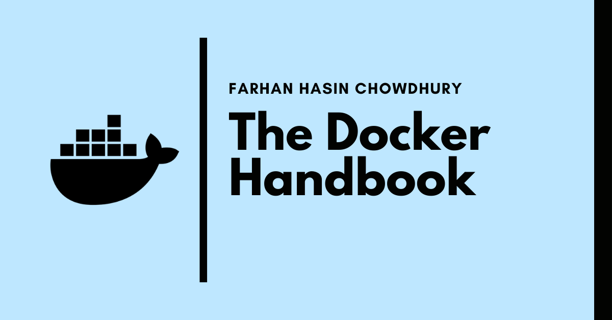

# The Docker Handbook

The concept of containerization itself is pretty old, but the emergence of the [Docker Engine](https://docs.docker.com/get-started/overview/#docker-engine) in 2013 has made it much easier to containerize your applications.

According to the [Stack Overflow Developer Survey - 2020](https://insights.stackoverflow.com/survey/2020#overview), [Docker](https://docker.com/) is the [\#1 most wanted platform](https://insights.stackoverflow.com/survey/2020#technology-most-loved-dreaded-and-wanted-platforms-wanted5), [\#2 most loved platform](https://insights.stackoverflow.com/survey/2020#technology-most-loved-dreaded-and-wanted-platforms-loved5), and also the [\#3 most popular platform](https://insights.stackoverflow.com/survey/2020#technology-platforms).

As in-demand as it may be, getting started can seem a bit intimidating at first. So in this article, we'll be learning everything from basic to intermediate level of containerization. After going through the entire article, you should be able to:

* Containerize \(almost\) any application
* Upload custom Docker Images to online registries
* Work with multiple containers using Docker Compose

## Prerequisites

* Familiarity with the Linux Terminal
* Familiarity with JavaScript \(some of the later projects use JavaScript\)

## Project Code

Code for the example projects can be found in the following repository:



You can find the complete code in the [`containerized`](https://github.com/fhsinchy/docker-handbook-projects/tree/containerized) branch.

## Contributions

This piece of literature is completely open-source and quality contributions are more than welcomed. You can find the full content in the following repository:



I usually do my changes and updates on the GitBook version of the book first and then publish them on freeCodeCamp. You can always updated and often incomplete version in the following link:



