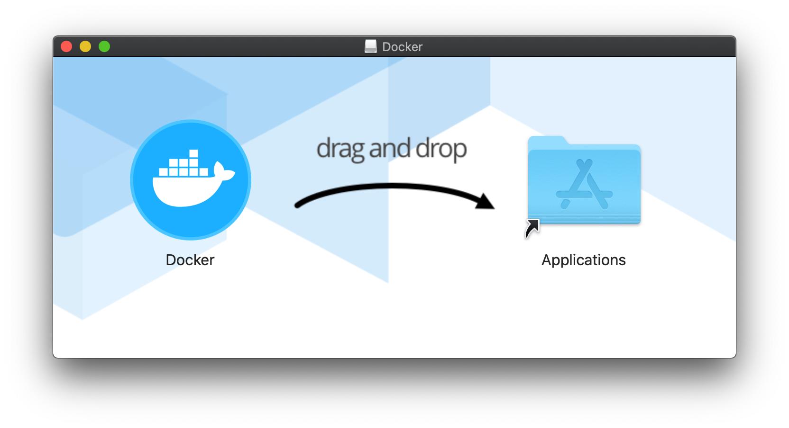
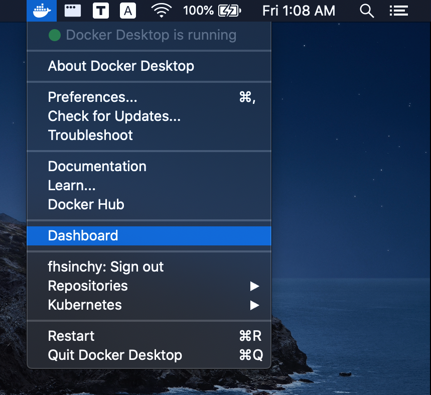
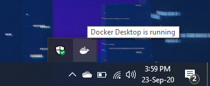
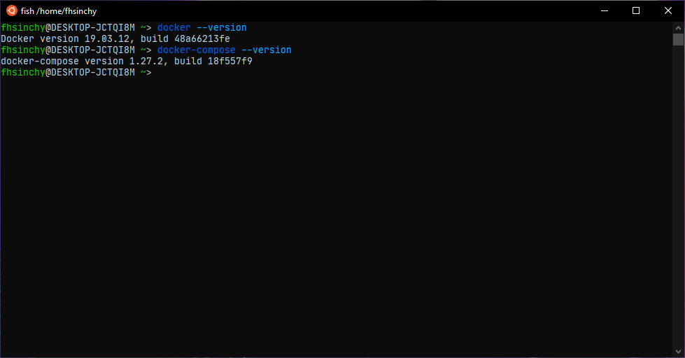
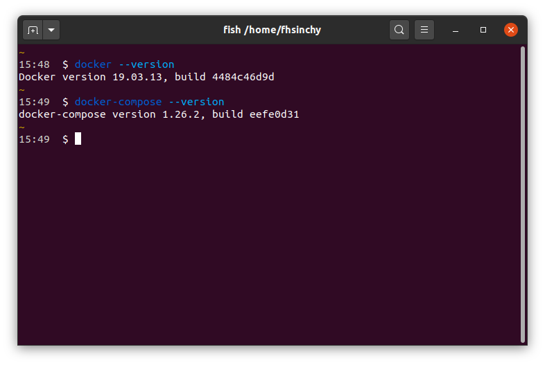

# Installing Docker

Installation of Docker varies greatly depending on the operating system you’re on but is universally simple across the board. Docker runs flawlessly on all three major platforms, i.e. Mac, Windows and Linux. Among the three, the installation process on Mac is the easiest.  

On a mac, all you have to do is navigate to the official [download page](https://www.docker.com/products/docker-desktop) and click the _Download for Mac \(stable\)_ button. You’ll get a regular looking `dmg` file and inside, there will be the application. All you have to do is drag the file and drop it on your Applications directory.

You can start Docker by simply double clicking the application icon. Once the application start, you'll see the Docker icon appear on your menu-bar.

On Windows, the procedure is almost the same, except there are a few extra steps that you’ll need to go through. The installation steps are as follows:  

1. Navigate to [this site](https://docs.microsoft.com/en-us/windows/wsl/install-win10) and follow the instructions for installing WSL2 on Windows 10.
2. Then navigate to the official [download page](https://www.docker.com/products/docker-desktop) and click the _Download for Windows \(stable\)_ button.
3. Double click the downloaded installer and go through the installation with the defaults.

Once the installation is done, start _Docker Desktop_ either from the start menu or your desktop. The docker icon should show up on your taskbar.

Now, open up Ubuntu or whatever distro you've installed from Microsoft Store. Execute `docker --version` and `docker-compose --version` commands to make sure that the installation was successful.

You can access Docker from your regular Command Prompt or Powershell as well. It's just I prefer using WSL2 over any other command line on Windows.

Installation of Docker on Linux is the most different one and depending on the distribution you’re on, it may vary even more. But to be honest, the installation is just easy \(if not easier\) as the other two platforms.

The Docker Desktop package on Windows or Mac is a collection of tools like Docker Engine, Docker Compose, Docker Dashboard, Kubernetes and a few other goodies. On Linux however, you don’t get such a bundle. What you do instead is you install all the necessary tools you need manually. Installation procedures for different distributions are as follows:

* If you’re on Ubuntu, you may follow the [Install Docker Engine on Ubuntu](https://docs.docker.com/engine/install/ubuntu/) section from the official docs.
* For other distributions, _installation per distro_ guides are available on the official docs.
  * [Install Docker Engine on Debian](https://docs.docker.com/engine/install/debian/)
  * [Install Docker Engine on Fedora](https://docs.docker.com/engine/install/fedora/)
  * [Install Docker Engine on CentOS](https://docs.docker.com/engine/install/centos/)
* If you’re on a distro that is not listed in the docs, you may follow the [Install Docker Engine from binaries](https://docs.docker.com/engine/install/binaries/) guide and get the thing installed.
* Regardless of the procedure you follow, you’ll have to go through some [Post-installation steps for Linux](https://docs.docker.com/engine/install/linux-postinstall/) universally.
* Once you’re done with the docker installation, you’ll have to install another tool named Docker Compose. You may follow the [Install Docker Compose](https://docs.docker.com/compose/install/) guide from the official docs. 

Once it’s done, open up the terminal and execute `docker --version` and `docker-compose --version` to ensure the success of the installation.

Although Docker performs quite well regardless of the platform you’re on, I prefer Linux over the others. Throughout the article, I’ll be on [Ubuntu 20.04.1 LTS](https://releases.ubuntu.com/20.04/) release. It isn’t going to make any difference on your side of things but I’m just clarifying the state.

Another thing that I would like to clarify right from the get go, is that I won't be using any GUI tool for working with Docker throughout the entire article. I'm aware of the nice GUI tools available for different platforms, but learning the CLI is more important because that's what you'll be dealing with when you start working on real-life servers.

