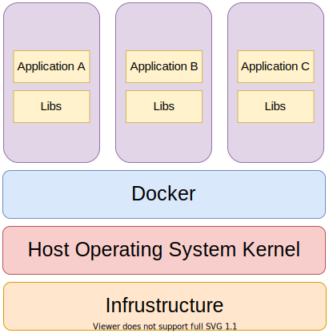

# Introduction to Containerization and Docker

Containerization is the process of encapsulating software code along with all of its dependencies inside a single package, so that it can be run consistently anywhere.

Docker is an open source containerization platform. It provides the ability to run applications in an isolated environment known as a container.

Containers are like very lightweight virtual machines that can run directly on our host operating system's kernel without the need of a [hypervisor](https://www.redhat.com/en/topics/virtualization/what-is-a-hypervisor). As a result we can run multiple containers simultaneously.

Each container contains an application along with all of its dependencies and is isolated from the other ones. Developers can exchange these containers as image\(s\) through a registry and can also deploy directly on servers.

## Virtual Machines vs Containers

A virtual machine is the emulated equivalent of a physical computer system with their virtual CPU, memory, storage, and operating system.

A program known as a hypervisor creates and runs virtual machines. The physical computer running a hypervisor is called the host system, while the virtual machines are called guest systems.

The hypervisor treats resources — like the CPU, memory, and storage — as a pool that can be easily reallocated between the existing guest virtual machines.

Hypervisors are of two types:

* Type 1 Hypervisor \(VMware vSphere, KVM, Microsoft Hyper-V\).
* Type 2 Hypervisor \(Oracle VM VirtualBox, VMware Workstation Pro/VMware Fusion\).

A container is an abstraction at the application layer that packages code and dependencies together. Instead of virtualizing the entire physical machine, containers virtualize the host operating system only.

Containers sit on top of the physical machine and its operating system. Each container shares the host operating system kernel and, usually, the binaries and libraries, as well.

